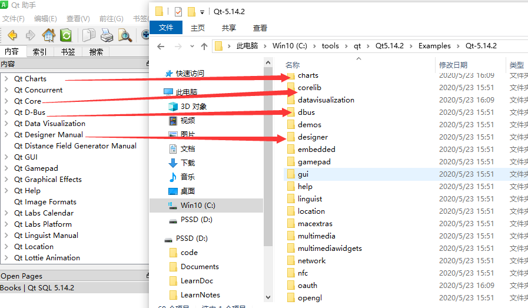

### 原来Qt Examples 代码是这样读的

在查看`samples`代码的时候，我发现每个文件下都有一个`doc\src`文件下，下面有一些`.qdoc`的文件发现都是讲解这个功能的，而且`doc\image`还有一些图片，通过查看检索发现这些文件在qt助手中能打开这些文件。打开qt助手后再次确认，qt助手中的内容目录 是和`samples`是一一对应的，如图所式

这个可以快速，帮助我们理解samples的功能，查询相关`api`也能比较快速。感觉比我之前，慢慢阅读代码速度快多了。