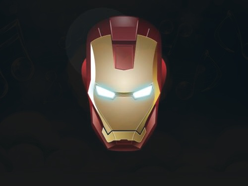

### OpenCV图像的基本操作

#### 访问与修改像素值

```python
import numpy as np
import cv2 as cv
img = cv.imread('D:\\Codelearn\\python\\opencv\\image\\timg.jpg')

# 访问像素
# px = img[100, 100]
# print(px)

for x in range(10, 100):
    for y in range(10, 100):
        img[x, y] = [255, 0, 0]

cv.namedWindow('image', cv.WINDOW_NORMAL)
cv.imshow('image', img)
cv.waitKey(0)
cv.destroyAllWindows()

```

#### 属性访问

```python
print(img.size)    # 大小
print(img.shape)   # 形状
print(img.dtype)   # 图像数据类型

结果
2359296
(768, 1024, 3) //后面这个3 表示为图像的通道数 
uint8
```

```python
img[:, :, 2] = 0  # 所有红色通道的设置为0
img[:, :, 1] = 0  # 所有绿色通道的设置为0
img[:, :, 0] = 0  # 所有蓝色通道的设置为0
```

#### 图像融合

```python
img1 = cv.imread('D:\\code\\Python_Code\\opencv\\image\\5.jpg')
img2 = cv.imread('D:\\code\\Python_Code\\opencv\\image\\9.jpg')
dst = cv.addWeighted(img1, 0.1, img2, 0.9, 0)
cv.imwrite("'D:\\code\\Python_Code\\opencv\\image\\merge.jpg'",dst)
cv.imshow('dst', dst)
cv.waitKey(0)
cv.destroyAllWindows()
# 问题思考：运动图片的模糊化修补，可以通过图片本身的微量旋转的区域叠加，到达效果呢？？
```



```python
import numpy as np
import cv2 as cv

# 加载两张图片
img1 = cv.imread('D:\\code\\Python_Code\\opencv\\image\\2.jpg')
img2 = cv.imread('D:\\code\\Python_Code\\opencv\\image\\10.jpg')

# 我想把logo放在左上角，所以我创建了ROI
rows, cols, channels = img2.shape  # 原因 行数5
roi = img1[0:rows, 0:cols]

# 现在创建logo的掩码，并同时创建其相反掩码
img2gray = cv.cvtColor(img2, cv.COLOR_BGR2GRAY)
ret, mask = cv.threshold(img2gray, 10, 255, cv.THRESH_BINARY)
mask_inv = cv.bitwise_not(mask)

# 现在将ROI中logo的区域涂黑
img1_bg = cv.bitwise_and(roi, roi, mask=mask_inv)
# 仅从logo图像中提取logo区域
img2_fg = cv.bitwise_and(img2, img2, mask=mask)

# 将logo放入ROI并修改主图像
dst = cv.add(img1_bg, img2_fg)
img1[0:rows, 0:cols] = dst
cv.imshow('res', img1)
cv.waitKey(0)
cv.destroyAllWindows()
```


报错: (-215:Assertion failed) (mtype == CV_8U || mtype == CV_8S) && _mask.sameSize(*psrc1) in function 'cv::binary_op'

原因我任意下载了两张图，之前10.jpg的图比本身的2.jpg的图都还大，在第5行代码中分别取到了img2的大小.在第10行代码去涂黑的时候就超界了，所以将10.jpg换成一张小图就可以了。（看了很多网上的帖子，都说是通道的问题，但是我这边一张同样通道的图，修改到超大小，就会报错。）  原理为什么，后面再考据一下。

```python
rows, cols, channels = img2.shape  # 原因 行数5
img1_bg = cv.bitwise_and(roi, roi, mask=mask_inv) #行数10
```

在搜索过程中发现一个和上面差不多的报错，再次也记录下来

(-215:Assertion failed) src.type() == CV_8UC1 in function ‘cv::adaptiveThreshold’：
这个报错的原因：错误是告诉您的图像不是8位灰度图像。
把图像改为彩色图
gray= cv.cvtColor(src, cv.COLOR_BGR2GRAY)
