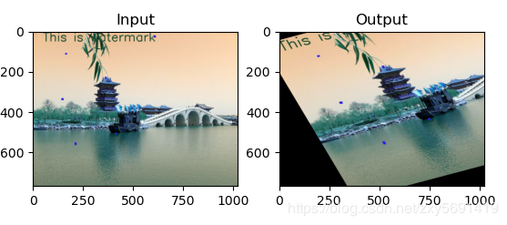
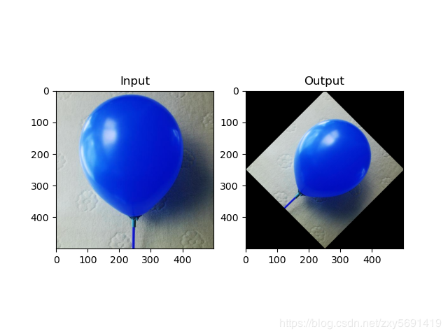

### opencv（6）图像的几何变换

#### 变换

cv.warpAffine和cv.warpPerspective，您可以使用它们进行各种转换。cv.warpAffine采用2x3转换矩阵，而cv.warpPerspective采用3x3转换矩阵作为输入

#### 缩放 

cv.resize()

```python
res = cv.resize(img,None,fx=2, fy=2, interpolation = cv.INTER_CUBIC)
# cv.INTER_AREA用于缩小，cv.INTER_CUBIC（慢）和cv.INTER_LINEAR用于缩放
```

平移

您可以将其放入np.float32类型的Numpy数组中，并将其传递给cv.warpAffine函数。

```python
import numpy as np
import cv2 as cv
img = cv.imread('D:\\Codelearn\\python\\opencv\\image\\person.jpg',0) # 读取灰度图 
rows, cols = img.shape
M = np.float32([[1, 0, 100], [0, 1, 50]])
dst = cv.warpAffine(img, M, (cols, rows))
cv.imshow('img', dst)
cv.waitKey(0)
cv.destroyAllWindows()
# 在使用这个实例的时候  发现我的图片怎么是黑白的  如何修改为显示彩色照片呢 我将代码修改为如下
img = cv.imread('D:\\Codelearn\\python\\opencv\\image\\person.jpg') # 显示彩色图片
rows, cols, alp = img.shape # 彩色图片在返回 shape 需要增加透明度通道alp

```

#### 旋转，

cv.getRotationMatrix2D()

```python
# 45度的时候会发现 是在原图空间大小中去绘画的 通过修改最后一个参数可以设置缩放因子 
M = cv.getRotationMatrix2D(((cols-1)/2.0, (rows-1)/2.0), 45, 1）
# M = cv.getRotationMatrix2D(((cols-1)/2.0, (rows-1)/2.0), 45, 0.5)
dst = cv.warpAffine(img, M, (cols, rows))
```

#### 仿射变换

cv.getAffineTransform()将创建一个2x3矩阵，该矩阵将传递给cv.warpAffine()。

```python
import cv2 as cv
import numpy as np
from matplotlib import pyplot as plt
img = cv.imread('D:\\Codelearn\\python\\opencv\\image\\new_timg.jpg')
rows, cols, ch = img.shape
pts1 = np.float32([[50, 50], [200, 50], [50, 200]])
pts2 = np.float32([[10, 100], [200, 50], [100, 250]])
M = cv.getAffineTransform(pts1, pts2)
dst = cv.warpAffine(img, M, (cols, rows))
# 插入显示信息 发现转换后的颜色是正常的 那么肯定就是 pyplot引起的 
cv.imshow('img2', dst) 

plt.subplot(121), plt.imshow(img), plt.title('Input')
plt.subplot(122), plt.imshow(dst), plt.title('Output')
plt.show()
```

效果图 发现颜色显示有问题



原因：使用cv2.imread()接口读图像，读进来的是BGR格式以及【0～255】，而matplotlib中使用的是RGB所以我们在显示之前需要做一次颜色转化，颜色转化的两种方式

```python
# res = cv2.cvtColor(img, cv2.COLOR_BGR2RGB)
# res = img[:,:,[2,1,0]]
# 修改后的代码如下 显示正常
img_2 = img[:,:,[2,1,0]]
img_3 = dst[:,:,[2,1,0]]
plt.subplot(121), plt.imshow(img_2), plt.title('Input')
plt.subplot(122), plt.imshow(img_3), plt.title('Output')
plt.show()

```

#### 透视变化

对于透视变换，您需要3x3变换矩阵。即使在转换后，直线也将保持直线。要找到此变换矩阵，您需要在输入图像上有4个点，在输出图像上需要相应的点。在这四个点中，其中三个不应共线。然后可以通过函数cv.getPerspectiveTransform()找到变换矩阵。然后将cv.warpPerspective()应用于此3x3转换矩阵。 

设定一个目标：将一张正方形图片变成菱形的变化 

```python
import cv2 as cv
import numpy as np
from matplotlib import pyplot as plt
img = cv.imread('D:\\Codelearn\\python\\opencv\\image\\2.jpg')

rows, cols, ch = img.shape
pts1 = np.float32([[0, 0], [rows, 0], [0, cols], [rows, cols]])
tmp1 = rows / 2
tmp2 = cols / 2
# 逆时针90度
# pts2 = np.float32([[0, tmp2], [tmp1, cols], [tmp1, 0], [rows, tmp2]])  
# 顺时针90度
pts2 = np.float32([[tmp1, 0], [rows, tmp2], [0, tmp2], [tmp1, cols]])  
M = cv.getPerspectiveTransform(pts1, pts2)
dst = cv.warpPerspective(img, M, (rows, cols))
plt.subplot(121), plt.imshow(img), plt.title('Input')
plt.subplot(122), plt.imshow(dst), plt.title('Output')
plt.show()
```

效果图
