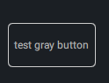
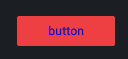

### QML自定义控件（一）

学习背景：QML的界面开发其中最大一个意义在于，可以十分简单的创建一个属于自己的控件，而且能被重复的使用。今天我以Button为例简单介绍一下我在定义控件中所遇到的问题。我们都知道任何控件几乎都可以用Rectangle来开始，然后里面你想怎么画都可以。但我个人的观点是更喜欢用Button的，但是他们两个都有自己使用的场景。但是在一些特殊控件的自定义的时候，我这边一般还是喜欢使用相关功能的继承关系

#### 目标实现

一个边框可以设定颜色，移动上去后有变化的button边框颜色高亮

##### 第一种方式在Rectangle

```qml
/*-------------------------------
  * Author:Teacher zeng
  * Date  : 2020.05
  * Unit description: 用Rectangle自定义button控件
  */
import QtQuick 2.12
import QtQuick.Controls 2.12
import "../skin/CSkin.js" as CSkin

Rectangle {
    id:root
    property alias text: txt.text
    property string txtcolor: ""
    property string txthovercolor : ""
    property alias containsMouse: area.containsMouse
    property alias containsPress: area.containsPress

    signal clicked
    radius: 5
    color: "transparent"
    Text{
        id:txt
        color: containsMouse ? txthovercolor : txtcolor
        font.pixelSize : CSkin.font_normalSize
        font.family    : CSkin.font_family
        font.weight    : CSkin.font_weight
        anchors.centerIn: parent
    }

    MouseArea {
        id: area
        anchors.fill: parent;
        hoverEnabled: parent.enabled;
        onClicked: root.clicked();
        cursorShape: Qt.PointingHandCursor
    }
}
```

##### 第二种方式 Button

```qml
/*-------------------------------
  * Author:Teacher zeng
  * Date  : 2020.05
  * Unit description: 用Button自定义Button控件
  */
import QtQuick 2.12
import QtQuick.Controls 2.12
import "../skin/CSkin.js" as CSkin
import QtQuick.Templates 2.12 as T

T.Button{
    id: root
    property alias txt:t.text
    property alias border: bg.border
    property alias color : bg.color
    property string txtcolor: ""
    property string txthovercolor : ""
    property alias containsMouse: area.containsMouse
    property alias containsPress: area.containsPress
    CText {
       id:t
       anchors.centerIn: parent
       color: containsMouse ? txthovercolor : txtcolor
    }

    background: Rectangle{
        id:bg
        anchors.fill: root
        radius: 5
        color: "transparent"
    }
    MouseArea {
        id: area
        anchors.fill: parent;
        hoverEnabled: parent.enabled; //增加了这个效果才能使得area.containsMouse有效果
        onClicked: root.clicked();
        cursorShape: Qt.PointingHandCursor
    }
}
```

两种写法的方式都很相识，原因在于我们在查看帮助文档的时候回发现。Button和Rectangle之间的属性差异不太多。各自没有太大的优势，所以都可以。

调用方式我用了两层，附上代码

```qml
// CGrayButton.qml
import QtQuick 2.12
import "../skin/CSkin.js" as CSkin

CButton {
    border.color:enabled ? (containsMouse ?(containsPress ? CSkin.btn_gray_press_color : CSkin.btn_gray_hover_color )
                                          :CSkin.btn_gray_normal_color ) : CSkin.btn_gray_disable_color

    txtcolor: CSkin.txt_gray_color
    txthovercolor: CSkin.txt_gray_color
}

//main.qml 中调用
CGrayButton{
    x:210;y:100
    width: 100
    height: 50
    txt: "test gray button"
    onClicked:{
    console.log("test ")
    }
}
```

##### 效果图：



#### 需求变化：

现在我们鼠标移动上去需要使用不同的图片，这个时候我的就会使用image作为基础控件

```qml
import QtQuick 2.12
/*-------------------------------
  * Author:Teacher zeng
  * Date  : 2020.05
  * Unit description: imagebutton
  */
import QtQuick.Controls 2.12
import QtQuick.Controls.Styles 1.4
Image {
    id: root
    //image
    property string img_normal : ""
    property string img_hover  : ""
    property string img_press  : ""
    property string img_disable: ""

    //text color
    property string txt_normal_color : "transparent"
    property string txt_hover_color  : "transparent"
    property string txt_press_color  : "transparent"
    property string txt_disable_color: "transparent"

    property alias text: t.text
    property alias containsMouse: area.containsMouse
    property alias containsPress: area.containsPress

    width  : sourceSize.width
    height : sourceSize.height


    source: enabled ? (containsMouse ?(containsPress ? img_press : img_hover )
                                    :img_normal ) : img_disable

    Text {
        id: t
        color: enabled ? (containsMouse ?(containsPress ? txt_press_color : txt_hover_color )
                                         :txt_normal_color ) : txt_disable_color
       anchors.centerIn: parent
    }
    MouseArea{
        id: area
        anchors.fill: parent;
        hoverEnabled: parent.enabled;
        onClicked: root.clicked();
        cursorShape: Qt.PointingHandCursor
    }
}
```

调用

```
    CImageButton {
       x:200;y:200
       txt_normal_color:"blue"
       txt_hover_color: "green"
       img_normal  : "qrc:/image/normal.png"
       img_hover   : "qrc:/image/over.png"
       img_press   : "qrc:/image/press.png"
       img_disable : "qrc:/image/disable.png"

       text: "button"

    }
```

##### 效果图



今天主要都是写一些吗？没有相关的知识点分享，但是最后提一个问题吧，有兴趣的初学者可以试一试，如何自定一个RadioButton？