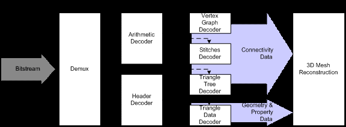

### MPEG  第二部分 

 [视频对象的压缩格式](https://mpeg.chiariglione.org/standards/mpeg-4/video)

#### 相关概念

包含的技术有  2D图形编码  二维视频编码  3D图形编码

SO / IEC 14496-2指定了一种视频编解码器，该编解码器可以有效压缩矩形（基于帧）视频。支持多种应用，范围从移动视频传输所需的极低速率和分辨率到专业生产领域中适用的高速率，分辨率和保真度。还支持其他功能，例如可伸缩性和错误恢复能力。

DCT（离散余弦变换，类似于离散傅里叶变换[DFT]）经常被信号处理和图像处理使用，用于信号和图像进行有损数据压缩。

VOP (Video Object Plane  视频对象平面) VOP 是一个物件单位，MPEG-4 可以将画面上的每个物体（物件）切割出来，个别压缩， 由许多个 VOP 组成一个画面。一个VOP是一个VO在特定时刻的快照，反映了该时刻VO的形状、纹理和运动参数，一般来说，一个VOP是一个任意形状的图像.
分为B-VOP （双向预测VOP）和 P-VOP (单向预测VOP)

QCIF （QCIF是常用的标准化图像格式，意为四分之一公共中间格式，规定了视频采集设备的标准采集分辨率。QCIF = 176×144像素）
下面为5种CIF[图像格式](https://baike.baidu.com/item/图像格式)的参数说明。参数次序为“图像格式亮度取样的像素个数(dx) 亮度取样的行数 (dy) 色度取样的像素个数(dx/2) 色度取样的行数(dy/2)”。

> 1. sub-QCIF 128×96 64 48 ()
> 2. 2.QCIF 176×144 88 72(PAL) / QCIF 160×120 (NTSC)
> 3. CIF 352×288 176 144(PAL)/ CIF 320×240 (NTSC)
> 4. 4CIF 704×576 352 288(PAL)/ 4CIF 640×480 (NTSC)（即我们经常说的D1）

VLC（variable-length coding），变长编码，即编码时每个符号的码字长度不一样。例如经典的[霍夫曼编码](https://baike.baidu.com/item/霍夫曼编码)（Huffman Coding）、香农-凡诺算法等

PCM（脉冲编码调制）在光纤通信系统中，光纤中传输的是二进制光脉冲“0”码和“1”码，它由二进制数字信号对光源进行通断调制而产生。而数字信号是对连续变化的模拟信号进行抽样、量化和编码产生的，称为PCM。有两个标准 E1 和T1

- TI 速率是1.544Mbit/s 
- E1 的速率是2.048Mbit/s

DPCM（差分脉冲编码调制）是一种对模拟信号的编码模式，传输的比特率要比PCM的低，相应要求的系统传输带宽也大大地减小了。MPEG中称预测编码

SNR （信噪比）即放大器的输出信号的功率，与同时输出的噪声功率的比值，常常用分贝数表示

基本编码方法有哪些：**B VOP，隔行编码**

bba：基于骨骼的动画，该工具由于具有多层结构，可以实现通用模型的更高质量的表示和动画结构：骨骼，肌肉和皮肤。 

#### 技术方案

##### 支持的格式

MPEG-4 Visual支持以下格式和比特率：

- 比特率：通常在5 kbit / s至1 Gbit / s之间
- 逐行视频和隔行视频
- 不同的颜色采样格式（包括4：2：0、4：2：2和4：4：4）
- 分辨率：从sub-QCIF到`Studio`（4k x 4k像素）

##### 压缩效率

压缩算法是混合编码（运动补偿预测和标量量化DCT系数编码的组合）。具体工具包括：

- 四分之一像素精度和可变块大小（8x8或16x16）可用于运动补偿；
- 全局运动补偿，允许仅使用少量参数来表达例如摄像机运动的影响；
- 可以选择不同的VLC表，其中将代码设计为在较低或较高速率范围内进行更有效的编码；选择由编码器控制，并取决于目标速率；
- 在*短报头*模式下，实现了与H.263基线语法的比特流级别兼容性；
- 直接模式可以通过从同位的P-VOP运动矢量推断出B-VOP内的运动矢量，而没有速率开销。
- 对于高质量的录音棚存储和录音棚间传输应用，介绍了一种不同的DCT系数编码方法[[1\]](http://mpeg.chiariglione.org/technologies/mpeg-4/mp04-vid(r)/index.htm#_ftn1)。这是基于将DCT系数按相似的幅度值进行分组的方式，而不是传统的之字形游程长度和电平组合的熵编码方案。在此功能中，将VLC表的递归选择应用于系数组，其中选择功能依赖于先前编码的组。编码数据是组指示符和确定实际编码值的固定长度代码。
- 对于高质量的录音棚存储，定义了一种基于DPCM和PCM之间切换的无损编码方法。

##### 可伸缩性功能

*编码*器中的*复杂度可伸缩性*允许不同复杂度*的编码*器为给定的纹理，图像或视频生成有效且有意义的比特流。*解码器中的复杂度可伸缩性*允许给定的纹理，图像或视频比特流被复杂度不同的解码器解码。通常，重构的质量与所使用的解码器的复杂度有关。这可能需要功率较小的解码器仅解码一部分比特流。视频编解码器中定义的更具体的可伸缩性工具如下：

- *空间可伸缩性*允许解码器解码由编码器生成的总比特流的子集，以降低的空间分辨率重建和显示纹理，图像和视频对象。
- *时间可伸缩性*允许解码器解码由编码器生成的总比特流的子集，以降低的时间分辨率重建和显示视频。最多支持三个级别。
- *保真可伸缩性*（也称为*SNR可伸缩性*）允许将比特流解析为多个不同比特率的比特流层，从而仍可以将这些层的子集的组合解码为具有相同空间和时间分辨率但有意义的信号较低的保真度。比特流解析可以在传输期间或在解码器中进行。通常，重建的质量与用于解码和重建的层数有关。

##### 应用领域

基于帧的MPEG-4视频是一种格式，用于有效存储视频内容以及通过Internet和移动网络进行视频流传输，以及用于专业应用程序，例如工作室中的视频存储。

###  3D网格编码 3DMC

#### 3DMC方案

3DMC包含三个主要的编码块：拓扑外科手术（数据转换）；连接性，几何形状和其他属性的差分量化（量化）；和熵编码。在图1中，展示了3DMC解码器架构。

#### 功能性

3DMC提供30：1到40：1的压缩比，而没有明显的视觉下降。但是，压缩不是使用3DMC的唯一优势。3DMC支持以下功能：

- 压缩：支持3D模型的近乎无损到有损压缩。通常，在VRML ASCII文件上可以实现30：1到40：1的压缩比，而不会造成视觉效果下降。
- 增量渲染：使用3DMC，无需等待接收到完整的比特流就可以开始渲染。借助增量渲染功能，解码器可以仅使用整个比特流的一小部分开始构建模型。当延迟是关键问题时（例如对于家庭购物），此功能非常重要。
- 支持非歧管模型：由于使用3DMC拓扑外科手术具有压缩特性，因此仅支持可定向[[1\]](http://mpeg.chiariglione.org/technologies/mpeg-4/mp04-3dmc/index.htm#_ftn1)和歧管[[2\]](http://mpeg.chiariglione.org/technologies/mpeg-4/mp04-3dmc/index.htm#_ftn2)模型。对于非定向或非流形[[3\]](http://mpeg.chiariglione.org/technologies/mpeg-4/mp04-3dmc/index.htm#_ftn3)模型，执行称为拼接的专用操作来支持这些模型。
- 支持错误恢复能力：3DMC具有内置的错误恢复能力，可以减少网络错误，因为解码器可以从不受错误破坏的分区中构建模型。
- 支持渐进式传输：3D网格模型可能非常复杂，具有数百万个多边形。取决于观看距离，用户可能不需要百万个三角形的精度，但可能对数百个三角形感到满意。与LOD（详细程度）表示类似的可伸缩位流允许构建具有不同分辨率的3D模型来满足这种情况。