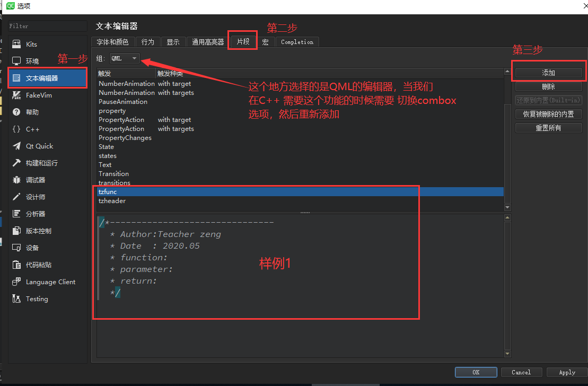

### 万事开头难

这是一个新的开始，新的语言，新的工作方式，最为重要的是新的学习方式和积累方式。我思考了很久都不知道，对于我一个有着7年开发经验的从业人员，真真切切的想去写一篇技术博客的时候应该从什么地方开始。就从我拿到`Qt Creator` 后一直忽略的一件小事开始吧。

在很多时候我们做开发，都需要去设置很多的文件说明，详细的描述单元的主要功能，函数的功能说明参数说明，返回值说明等等。这些常用的输入内容，应该有某种快捷的方式自动的生成或者生成一个大纲。其实没一个成熟的IDE中都有这样的功能，今天我就来说一下`Qt Creator`中的这个设置说起。

找到`工具`菜单中的`选项`开发，然后进入到`文本编辑器 ` 中名叫 `片段`的 page 然后点击添加



```c++
eg：/*-------------------------------
  * Author:Teacher zeng
  * Date  : 2020.05
  * Unit description: 建立与皮肤相关的一些配置常量
  */
    
  /*-------------------------------
  * Author:Teacher zeng
  * Date  : 2020.05
  * function: 
  * parameter:
  * return:
  */
```

为什么一开始，我要说这个呢？我现在作为一个全新的学习者，之前唯一能继承的就是那些代码规范了。而且一个重视注释的程序员，都是乐于分享的一个开始，因为注释是给以后所有能读到这个代码人看的，让他们能更快，更加容易的阅读代码。我的第一篇博客就简单的写到这个地方了，**简单的开始，锲而不舍的坚持，到深深的迷恋！**