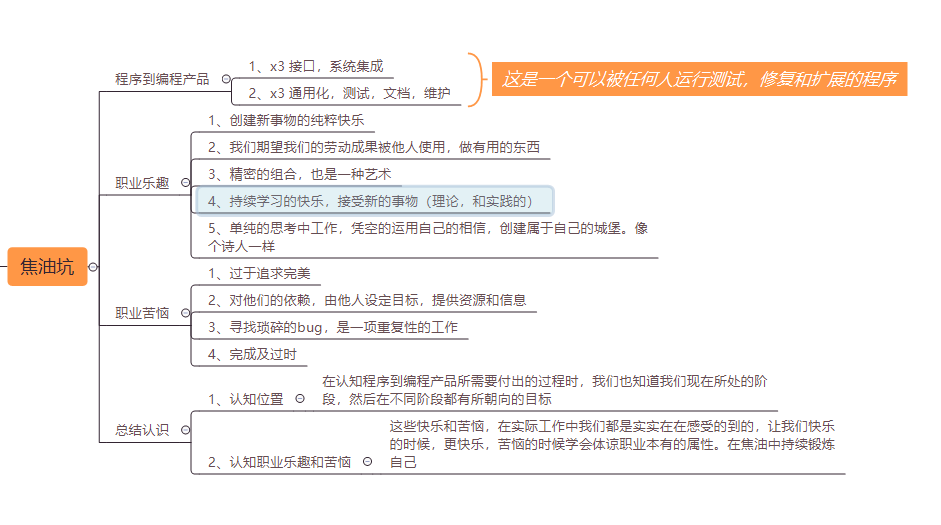

### 人月神话（1）焦油坑

#### 思维导图

#### 程序到编程产品

   + x3 接口，系统集成
   + x3 通用化，测试，文档，维护

编程产品：这是一个可以被任何人运行测试，修复和扩展的程序

#### 职业乐趣

+ 创建新事物的纯粹快乐
+ 我们期望我们的劳动成果被他人使用，做有用的东西
+ 精密的组合，也是一种艺术
+ 持续学习的快乐，接受新的事物（理论，和实践的）
+ 单纯的思考中工作，凭空的运用自己的相信，创建属于自己的城堡。像个诗人一样

#### 职业苦恼

+ 过于追求完美
+ 对他们的依赖，由他人设定目标，提供资源和信息
+ 寻找琐碎的bug，是一项重复性的工作
+ 完成及过时

#### 总结认识
+ 认知位置——在认知程序到编程产品所需要付出的过程时，我们也知道我们现在所处的阶段，然后在不同阶段都有所朝向的目标
+ 认知职业乐趣和苦恼——这些快乐和苦恼，在实际工作中我们都是实实在在感受的到的，让我们快乐的时候，更快乐，苦恼的时候学会体谅职业本有的属性。在焦油中持续锻炼自己
     		