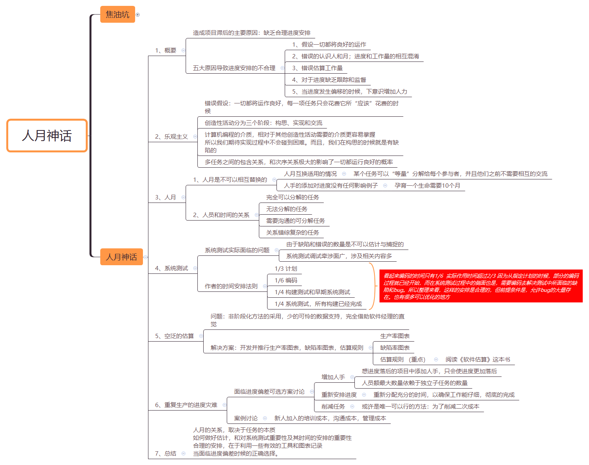
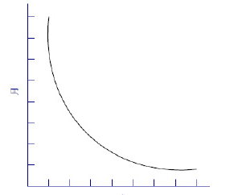
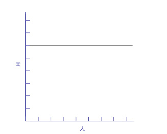
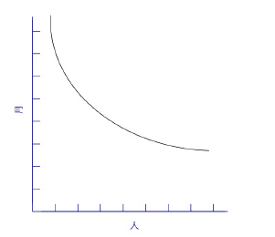
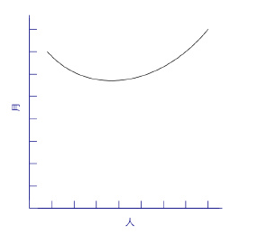

### 人月神话（2）人月神话

#### 思维导图

#### 概要

造成项目滞后的主要原因：**缺乏合理进度安排**
五大原因导致进度安排的不合理 

+ 假设一切都将良好的运作
+ 错误的认识人和月；进度和工作量的相互混淆		
+ 错误估算工作量			
+ 对于进度缺乏跟踪和监督			
+ 当进度发生偏移的时候，下意识增加人力			

#### 乐观主义

错误假设：一切都将运作良好，每一项任务只会花费它所“应该”花费的时候

创造性活动分为三个阶段：构思、实现和交流

计算机编程的介质，相对于其他创造性活动需要的介质更容易掌握所以我们期待实现过程中不会碰到困难。而且，我们在构思的时候就是有缺陷的 

多任务之间的包含关系，和次序关系极大的影响了一切都运行良好的概率

#### 人月关系

##### 人月是不可以相互替换的

人月互换适用的情况：某个任务可以“等量”分解给每个参与者，并且他们之前不需要相互的交流

人手的添加对进度没有任何影响例子：孕育一个生命需要10个月

##### 人员和时间的关系

完全可以分解的任务

无法分解的任务

需要沟通的可分解任务

关系错综复杂的任务

#### 系统测试

##### 系统测试实际面临的问题

由于缺陷和错误的数量是不可以估计与捕捉的

系统测试调试牵涉面广，涉及相关内容多			

#### 作者的时间安排法则

> 1/3 计划
> 1/6 编码
> 1/4 构建测试和早期系统测试
> 1/4 系统测试，所有构建已经完成

看起来编码的时间只有1/6  实际作用时间超过2/3 因为从指定计划的时候，部分的编码过程就已经开始，而在系统测试过程中的侧面也是，需要编码去解决测试中所面临的缺陷和bug。所以整理来看，这样的安排是合理的，但前提条件是，允许bug的大量存在。也有很多可以优化的地方

#### 空泛的估算

问题：非阶段化方法的采用，少的可怜的数据支持，完全借助软件经理的直觉

解决方案：开发并推行生产率图表，缺陷率图表，估算规则

> 生产率图表
> 缺陷率图表
> 估算规则 （重点）——阅读《软件估算》这本书

#### 重复生产的进度灾难

##### 面临进度偏差可选方案讨论

+ 增加人手
  想进度落后的项目中添加人手，只会使进度更加落后;人员额最大数量依赖于独立子任务的数量	
+ 重新安排进度
  重新分配充分的时间，以确保工作能仔细，彻底的完成
+ 削减任务
  或许是唯一可以行的方法：为了削减二次成本
  		

#### 案例讨论

新人加入的培训成本，沟通成本，管理成本

#### 总结

人月的关系，取决于任务的本质

如何做好估计，和对系统测试重要性及其时间的安排的重要性

合理的安排，在于利用一些有效的工具和图表记录

当面临进度偏差时候的正确选择。